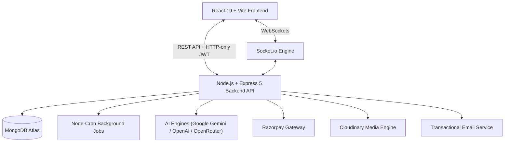

# OnTrip — AI-Powered Travel Planning & Booking Platform 🌍✈️

OnTrip is a full-stack, AI-driven travel planning and booking ecosystem designed to streamline trip discovery, intelligent itinerary generation, local service bookings, and traveler community interactions.

---

## 🌟 Key Highlights

- 🤖 **AI-Driven Travel Planner**: Multi-day itinerary generator with AI cost estimations, optimal route planning, weather context, and an interactive AI travel assistant powered by Google Gemini and OpenAI.
- 🏢 **Host & Provider Portal**: Service listing management, booking tracking dashboard, customer communication, and subscriber broadcast management for tour operators and local guides.
- 💳 **Seamless Booking & Checkout**: Complete checkout workflow with real-time price calculations, Razorpay integration, instant PDF invoice generation, and automated trip reminder alerts.
- 💬 **Live Chat & Community**: Socket.io real-time direct messaging between travelers and service hosts, along with a travel community feed (posts, media, likes, follows, and bookmarks).
- 🔐 **Secure Multi-Channel Auth**: Email/password registration, Google OAuth 2.0, OTP email verification, HTTP-only JWT cookies, and role-based access control.

---

## 🏗️ System Architecture



---

## 📁 Repository Structure

```
tripon/
├── ontrip-backend/            # Node.js + Express REST API & WebSocket server
│   ├── src/
│   │   ├── config/            # Database connection & third-party API configs
│   │   ├── controllers/       # Route controllers (Auth, Booking, AI, Social, Chat, Provider)
│   │   ├── jobs/              # Node-cron background jobs (Booking notifications & reminders)
│   │   ├── middleware/        # Authentication, JWT verification, and file upload middlewares
│   │   ├── models/            # Mongoose schemas (User, Provider, Booking, SocialPost, Chat, etc.)
│   │   ├── routes/            # Express route declarations
│   │   ├── services/          # AI Travel Planner algorithm, geocoding & weather engine
│   │   ├── socket/            # Socket.io live chat handlers
│   │   ├── app.js             # Express application initialization
│   │   └── server.js          # Server entry point (HTTP + WebSockets + Cron)
│   └── package.json
│
├── ontrip-frontend/           # React 19 + Vite single-page application
│   ├── src/
│   │   ├── components/        # Shared UI elements (Navbar, Sidebar, Footer, Modals, Cards)
│   │   ├── pages/             # Main views (Home, Explorer, AI Planner, Bookings, Chat, Community)
│   │   ├── styles/            # Page styles & modular CSS files
│   │   ├── utils/             # API client, helper utilities & formatters
│   │   ├── App.jsx            # Application routing & layout manager
│   │   └── main.jsx           # React app mount script
│   └── package.json
│
└── README.md                  # Project documentation
```

---

## 🛠️ Technology Stack

| Domain | Technology Stack |
| :--- | :--- |
| **Frontend UI** | React 19, Vite 7, React Router DOM v7, Custom CSS |
| **Frontend Utilities** | Leaflet Maps, HTML2Canvas, jsPDF, Socket.io-client |
| **Backend Runtime** | Node.js, Express.js (v5) |
| **Database & ORM** | MongoDB Atlas, Mongoose |
| **Real-time Server** | Socket.io |
| **Artificial Intelligence**| Google Gemini AI (`@google/genai`), OpenAI API, OpenRouter |
| **Payment Gateway** | Razorpay SDK |
| **Storage & Email** | Cloudinary, Multer, Brevo (Nodemailer) |

---

## 🚀 Quick Start Guide

### Prerequisites
- **Node.js** (v18.x or higher)
- **npm** (v9.x or higher)
- **MongoDB** instance (local or MongoDB Atlas)

---

### Installation & Setup

1. **Clone the Repository**
   ```bash
   git clone https://github.com/prashik24/OnTrip.git
   cd tripon
   ```

2. **Install Backend Dependencies**
   ```bash
   cd ontrip-backend
   npm install
   ```

3. **Install Frontend Dependencies**
   ```bash
   cd ../ontrip-frontend
   npm install
   ```

---

### Running the Application

1. **Start the Backend Server**
   ```bash
   cd ontrip-backend
   npm run dev
   ```
   *Backend server runs by default on `http://localhost:5000` (or as configured).*

2. **Start the Frontend Application**
   ```bash
   cd ontrip-frontend
   npm run dev
   ```
   *Frontend application runs by default on `http://localhost:5173`.*

---

## 📡 Core API Modules

| Module | Route Endpoint | Capabilities |
| :--- | :--- | :--- |
| **Auth** | `/api/auth` | User registration, login, Google OAuth, OTP verification, session checks |
| **AI Planner** | `/api/ai-planner` | Multi-day itinerary creation, location recommendations & AI travel chat |
| **Bookings** | `/api/bookings` | Order initiation, Razorpay payment verification, and booking history |
| **Providers** | `/api/providers` | Host registration, service listing creation, dashboard metrics |
| **Real-time Chat** | `/api/chat` | Conversation management and message persistence |
| **Community** | `/api/community` | Social posts feed, interactions (likes, comments), follower connections |
| **Broadcasts** | `/api/provider-broadcasts` | Provider subscriber group announcements & broadcasts |
| **Saved Trips** | `/api/saved-trips` | Bookmark and save generated travel plans |

---

## 🤝 Contributing

Contributions and feedback are always welcome!

1. Fork the repository
2. Create a feature branch (`git checkout -b feature/NewFeature`)
3. Commit your changes (`git commit -m 'Add NewFeature'`)
4. Push to the branch (`git checkout -b feature/NewFeature`)
5. Open a Pull Request

---

## 📄 License

This project is licensed under the MIT License.
Prashik Humane LCB2023039
